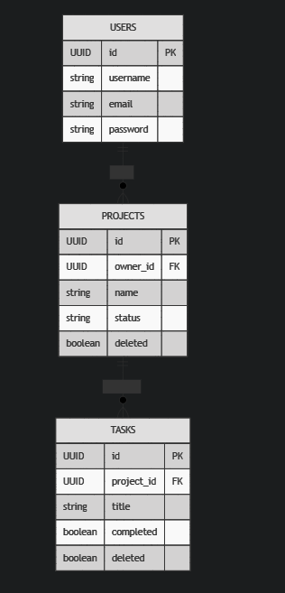

# Project Manager API & Web App

Technical assessment project developed with **Java 17** and **Spring Boot 3**, applying **Clean Architecture** and **Hexagonal Architecture (Ports & Adapters)** principles.

The application allows authenticated users to manage **projects and tasks**, enforcing strict business rules, security, and separation of concerns.

---
```
projectmanager/
├── src/main/java/com/riwi/projectmanager
│   ├── domain
│   │   ├── model              # Pure domain models (Project, Task, User)
│   │   ├── exception          # Business exceptions
│   │   └── ports
│   │       ├── in              # Use case interfaces
│   │       └── out             # Repository, audit, notification ports
│   │
│   ├── application
│   │   └── service             # Use case implementations (business logic)
│   │
│   ├── infrastructure
│   │   ├── persistence         # JPA adapters, entities, mappers
│   │   ├── security            # JWT, Spring Security, CurrentUser adapter
│   │   ├── audit               # Audit adapter
│   │   ├── notification        # Notification adapter
│   │   └── config              # OpenAPI & data initialization
│   │
│   └── presentation
│       ├── controller          # REST & Web controllers
│       ├── dto                 # Request/Response DTOs
│       └── exception           # Global exception handling
│
├── src/main/resources
│   ├── templates               # Thymeleaf views
│   ├── static
│   └── application.properties
│
├── src/test/java
│   └── application/service     # Unit tests for use cases
│
├── pom.xml
└── README.md
```
---

## 🗂️ Entity–Relationship Diagram (ERD)

The following diagram represents the database structure and relationships between users, projects, and tasks.



---

## 🚀 Features

- User authentication with **JWT**
- Project management (create, list, activate)
- Task management (create, complete)
- Business rule enforcement at domain level
- Audit logging and notifications
- REST API + Swagger documentation
- Simple frontend built with **Thymeleaf**
- Unit tests for critical business use cases

---

## 🧱 Architecture

This project follows **Clean Architecture with Hexagonal approach**:

- **Domain**  
  Pure business logic, entities, exceptions, and ports.  
  No dependencies on frameworks.

- **Application**  
  Use case implementations orchestrating domain logic.

- **Infrastructure**  
  Adapters for persistence (JPA), security (JWT), auditing, notifications, and configuration.

- **Presentation**  
  REST controllers, DTOs, exception handling, and web controllers.

➡️ All dependencies point **inward**, toward the domain.

---

## 🛠️ Tech Stack

- Java 17
- Spring Boot 3
- Spring Security + JWT
- Spring Data JPA
- MySQL / PostgreSQL (configurable)
- Thymeleaf
- Swagger / OpenAPI (Springdoc)
- JUnit 5 & Mockito
- Maven

---

## 🔐 Security

- JWT-based authentication
- Protected endpoints require valid token
- Users can only modify their own projects and tasks
- Proper handling of `401 Unauthorized` and `403 Forbidden`

---

## 📑 API Documentation

Swagger UI is available at runtime:

- `http://localhost:8080/swagger-ui.html`
- `http://localhost:8080/swagger-ui/index.html`

JWT token can be provided directly from Swagger UI to test protected endpoints.

---

## 🧪 Testing

Unit tests are focused on **business-critical use cases** and run **without Spring context**.

Covered scenarios include:

- Project activation with tasks
- Project activation without tasks (failure)
- Unauthorized project activation
- Task completion rules
- Audit & notification triggering

Tests are located in:

```text
src/test/java/com/riwi/projectmanager/application/service
```

---

## 🖥️ Frontend

A simple frontend built with **Thymeleaf** is included to demonstrate integration with the backend.

Features:
- Login
- List projects
- View project details
- Create and complete tasks

Visual design is minimal, focusing on functionality.

---

## ▶️ How to Run (Local)

### 1. Clone repository
```bash
git clone <repository-url>
cd projectmanager
```

### 2. Configure database
Edit `application.properties` if needed.

### 3. Run application
```bash
./mvnw spring-boot:run
```

App will be available at:
- `http://localhost:8080`

---

## 🧪 Test Credentials

Default user created at startup:

```text
Email: test@riwi.com
Password: 123456
```

---

## 📌 Business Rules Implemented

- A project can only be activated if it has at least one task
- Only the project owner can modify projects and tasks
- Completed tasks cannot be modified
- All deletions are logical (soft delete)
- Project activation and task completion generate:
    - Audit logs
    - Notifications

---

## 🧠 Technical Decisions

- Hexagonal Architecture to ensure high maintainability and testability
- Business rules enforced at use-case level
- Ports used to decouple domain from infrastructure
- JWT chosen for stateless authentication
- Thymeleaf selected for fast and simple frontend integration

---

## ✅ Assessment Notes

This solution prioritizes **clarity, correctness, and completeness** over unnecessary complexity, fully aligning with the assessment requirements.
